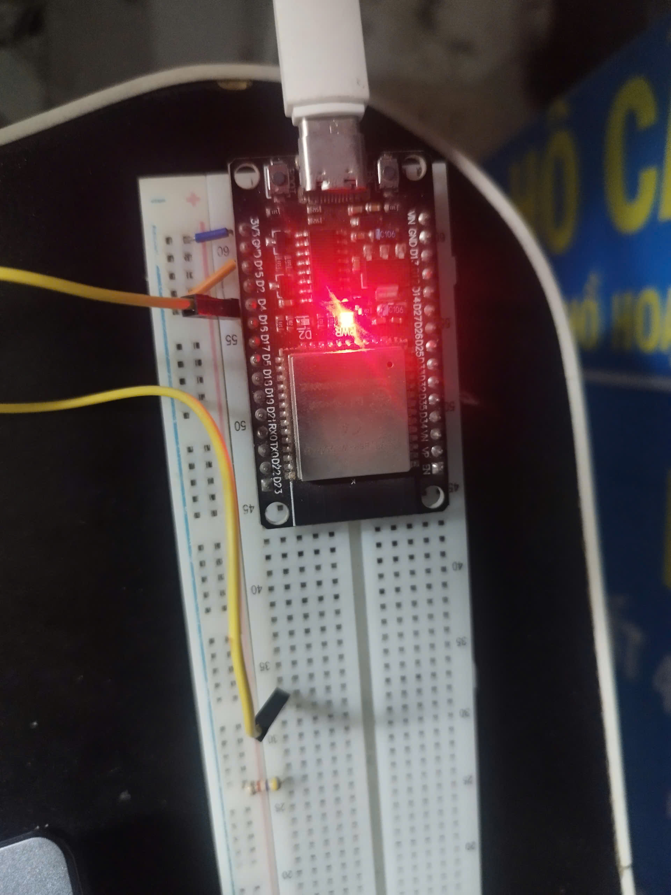

# ESP32 Blink LED

Simple LED blinking project using ESP-IDF and FreeRTOS.

## Features
- GPIO output control
- LED blinking every 500ms
- FreeRTOS task delay
- ESP-IDF framework

## Hardware
- ESP32 Dev Board
- On-board LED (GPIO2)

## Software
- ESP-IDF
- FreeRTOS

## Pin Configuration

| GPIO | Function |
|------|----------|
| GPIO2 | LED Output |

## Code Overview

```c
gpio_set_direction(LED_GPIO, GPIO_MODE_OUTPUT);
gpio_set_level(LED_GPIO, 1);
vTaskDelay(pdMS_TO_TICKS(500));
```

## How It Works
1. Initialize GPIO2 as output
2. Turn LED ON
3. Delay 500ms using FreeRTOS
4. Turn LED OFF
5. Repeat forever

## Concepts Used
- GPIO
- FreeRTOS
- Task Scheduling
- Embedded C

## Build & Flash

```bash
idf.py build
idf.py flash
idf.py monitor
```

## Demo
